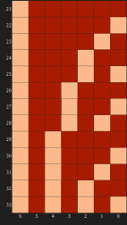

# Zeckendorf representation

***Give the 0-1 list that indicates the unique nonconsecutive Fibonacci numbers that sum to the non-negative integer input***

----

## Documentation

### Usage

| `zeckendor-representation(n)` |
|---|   
| Gives the 0-1 list that indicates the unique nonconsecutive Fibonacci numbers that sum to the non-negative integer $n$.|

### Details & Options

- The Fibonacci numbers here are considered to be $1, 2, 3, 5, ...$, not $1, 1, 2, 3, 5, ...$; otherwise, the representation would not be unique.

----

## Setup

```raku
use Math::NumberTheory;
use Math::Zeckendorf;

use Graph;
use Graph::Classes;
use Graphviz::DOT::Chessboard;

use Math::SparseMatrix;
```

---

## Examples

### Basic examples

The first number whose representation takes three summands is 12:

```raku
zeckendorf-representation(12)
```

```
# [1 0 1 0 1]
```

This corresponds to $8 + 3 + 1$:

```raku
[2,4,6]».&fibonacci 
```

```
# [1 3 8]
```

<div style="width: 50%; border-top: 1px solid gray; margin: 0 auto;"></div>

The first number whose representation takes four summands is $33$:

```raku
zeckendorf-representation(33)
```

```
# [1 0 1 0 1 0 1]
```

```raku
my @z = zeckendorf-representation(33);
([0, |@z.reverse] >>*<< ((1 ... @z.elems + 1)».&fibonacci)).sum
```

```
# 33
```

### Neat examples

There are $F_k$ Zeckendorf representations of length $k$; for example, here are the $13$ representations of length $7$:

```raku
#%html
zeckendorf-representation(21 ... 33)
andthen Math::SparseMatrix.new(dense-matrix => $_, row-names => (21...33), column-names => (^$_.head.elems).reverse)
andthen my $mat = $_;

[
    matrix => $mat.to-html(),
    plot => dot-matrix-plot($mat.dense-matrix, row-names => $mat.row-names, column-names => $mat.column-names, size => 3.5):svg
]
andthen to-html-table($_,)

```

<table style="border-collapse: collapse; border: 3px solid black;"><thead><tr><th style="border: 3px solid black; text-align: left;">matrix</th><th style="border: 3px solid black; text-align: left;">plot</th></tr></thead><tbody><tr><td style="border: 3px solid black; text-align: left;"><table border="1"><thead><tr><th></th><th>6</th><th>5</th><th>4</th><th>3</th><th>2</th><th>1</th><th>0</th></tr></thead><tr><th>21</th><td>1</td><td>.</td><td>.</td><td>.</td><td>.</td><td>.</td><td>.</td></tr><tr><th>22</th><td>1</td><td>.</td><td>.</td><td>.</td><td>.</td><td>.</td><td>1</td></tr><tr><th>23</th><td>1</td><td>.</td><td>.</td><td>.</td><td>.</td><td>1</td><td>.</td></tr><tr><th>24</th><td>1</td><td>.</td><td>.</td><td>.</td><td>1</td><td>.</td><td>.</td></tr><tr><th>25</th><td>1</td><td>.</td><td>.</td><td>.</td><td>1</td><td>.</td><td>1</td></tr><tr><th>26</th><td>1</td><td>.</td><td>.</td><td>1</td><td>.</td><td>.</td><td>.</td></tr><tr><th>27</th><td>1</td><td>.</td><td>.</td><td>1</td><td>.</td><td>.</td><td>1</td></tr><tr><th>28</th><td>1</td><td>.</td><td>.</td><td>1</td><td>.</td><td>1</td><td>.</td></tr><tr><th>29</th><td>1</td><td>.</td><td>1</td><td>.</td><td>.</td><td>.</td><td>.</td></tr><tr><th>30</th><td>1</td><td>.</td><td>1</td><td>.</td><td>.</td><td>.</td><td>1</td></tr><tr><th>31</th><td>1</td><td>.</td><td>1</td><td>.</td><td>.</td><td>1</td><td>.</td></tr><tr><th>32</th><td>1</td><td>.</td><td>1</td><td>.</td><td>1</td><td>.</td><td>.</td></tr><tr><th>33</th><td>1</td><td>.</td><td>1</td><td>.</td><td>1</td><td>.</td><td>1</td></tr></table></td><td style="border: 3px solid black; text-align: left;"><?xml version="1.0" encoding="UTF-8" standalone="no"?>
<!DOCTYPE svg PUBLIC "-//W3C//DTD SVG 1.1//EN"
 "http://www.w3.org/Graphics/SVG/1.1/DTD/svg11.dtd">
<!-- Generated by graphviz version 14.1.1 (20251213.1925)
 -->
<!-- Pages: 1 -->
</td></tr></tbody></table>

(Using a sparse matrix object made the visualizations easier.)

<div style="width: 50%; border-top: 1px solid gray; margin: 0 auto;"></div>

Make a plot of circle chords that correspond to pairs of integers that have Fibonacci representations with Hamming distance $1$. The chords in slate blue correspond to pairs differences that are prime numbers.

```raku
my @mat = (1 ... 250)».&zeckendorf-representation;
my $max-digits = @mat.tail.elems;
@mat .= map({ [|(0 xx ($max-digits - $_.elems)), |$_] });
my @edges = (^@mat.elems X ^@mat.elems).map({ $_ => hamming-distance(|@mat[$_]) }).grep({ $_.value == 1 })».key;
@edges .= map({ $_.head.Str => $_.tail.Str });
my $g = Graph.new(@edges, vertex-coordinates => Graph::Cycle.new(@mat.elems).vertex-coordinates);
```

```
# Graph(vertexes => 250, edges => 780, directed => False)
```

```raku
#% html
my @highlight = @edges.grep({ is-prime($_.value.Int - $_.key.Int) });
$g.dot(
    highlight => {slateblue => @highlight},
    vertex-shape => 'point', 
    vertex-width => 0, 
    vertex-height => 0, 
    edge-thickness => 0.3, 
    :4size,
    engine => 'neato', 
):svg
```

<?xml version="1.0" encoding="UTF-8" standalone="no"?>
<!DOCTYPE svg PUBLIC "-//W3C//DTD SVG 1.1//EN"
 "http://www.w3.org/Graphics/SVG/1.1/DTD/svg11.dtd">
<!-- Generated by graphviz version 14.1.1 (20251213.1925)
 -->
<!-- Pages: 1 -->
